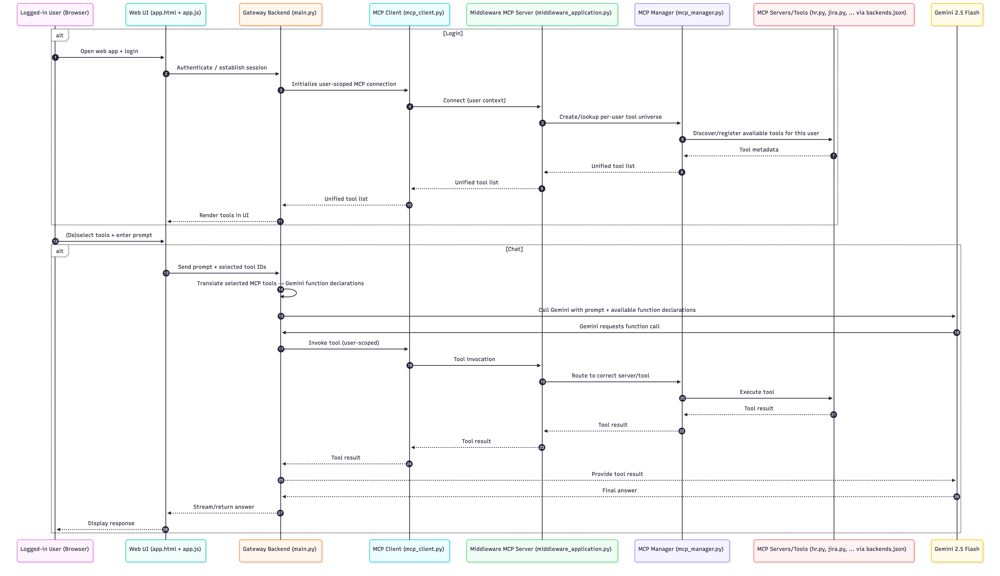

# Middleware for GenAI

---

## Prerequisites

Before starting you need to ensure you have the following on your machine:
* **Google AI API Key**: The free API key lets you integrate gemini models into Dive AI.
  * Tutorial on how to get it: [here](https://www.youtube.com/watch?v=prrb0hsfI60&t=9s)
  * Note: At the moment only Gemini models are supported and `Gemini 2.5 flash` is hardcoded (cannot be changed by user only be editing code)
* **GitHub repository**: You should have the complete repository on your machine.
* **Python**: Self-explanatory I guess.

---

## Set-Up

1. Navigate to the root of the repository (in terminal) and paste your **Google AI API Key** into the `.env` file i.e. `GEMINI_API_KEY=YOUR_API_KEY`. (otherwise the chat will not work)
2. Start the web application by executing `uvicorn components.gateway.app.main:app --reload --host 0.0.0.0 --port 8000`in the terminal.
3. The terminal logs will display the port the application is running on. (if http://0.0.0.0:8000 doesn't work, try http://127.0.0.1:8000 or http://localhost:8000 )
4. You should see a **log-in** formular. Log-in with user=`user` and password=`userpass`.
5. The available tools will be loaded (i.e. the connection to the middleware is initiated and available subset of tools retrieved that is allowed for this user/role ) which can take a couple of seconds.
6. By (un)checking the checkboxes next to the available tools, you can control which tools will be considered for the next answer.


---

## Running the current system

1. Type in your prompt in the chat window and hit enter. (please be advised that sometimes it'll fail as the setup is not completely stable yet, if that happens try another prompt)

For a detailed overview of how the systems runs internally have a look at the "Sequence flow chart" section below.

### Examples - MCP usage
Some examples you could ask are the following:

Transcript an Obama speech:
```
Prompt: hi, can you give me the transcript to the following YouTube video: https://www.youtube.com/watch?v=PnoXK77p3sM
```
Documentation overview of Apache Spark GitHub repository:
```
Prompt: could you give me the wiki structure of apache/spark?
```
etc.
## Sequence flow chart


